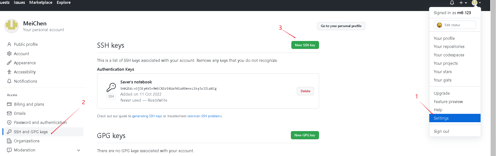
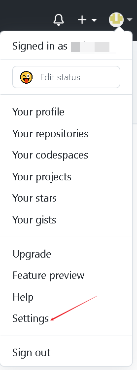
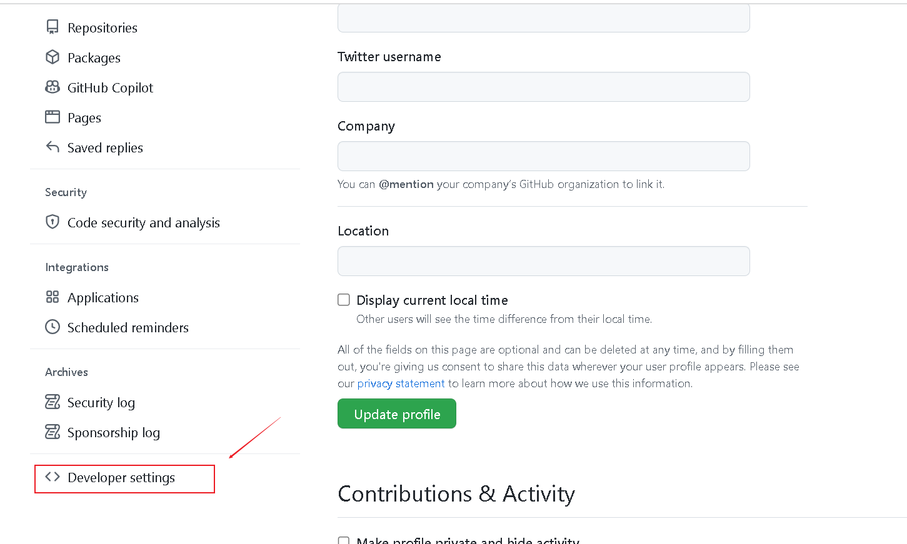
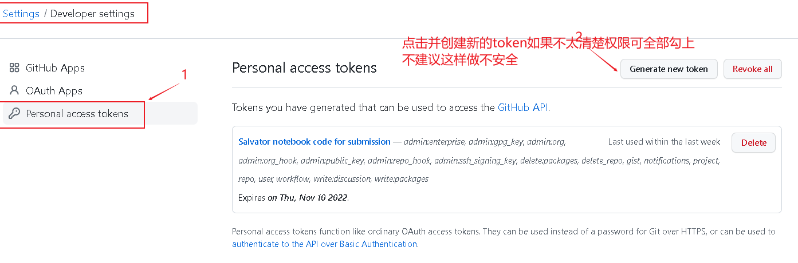
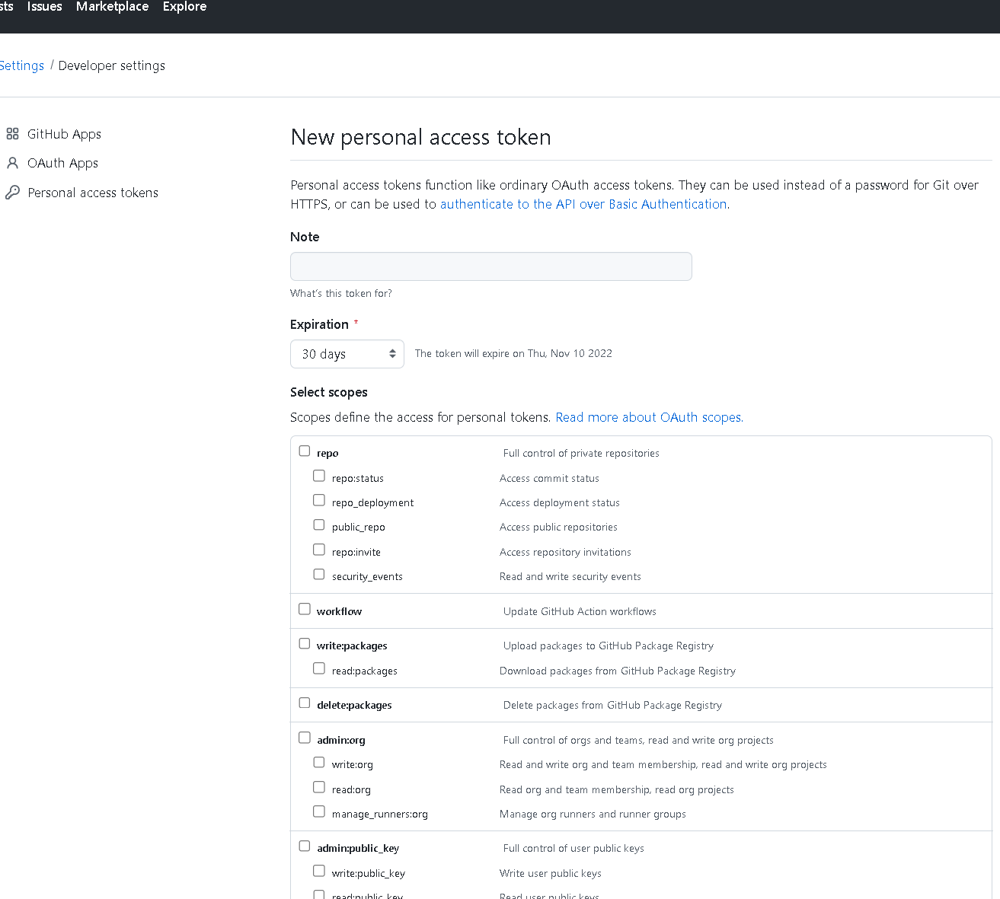

+++
author = "MeiChen"
title = "Git"
date = "2022-10-13"
description = "Git 学习之路"
categories = [

    "Git",

]
tags = [

    "Git",

    "版本控制", 

]
image = "git.jpeg"
+++


[Git 的使用](https://yin-hongwei.github.io/2019/11/05/Git%E5%B7%A5%E4%BD%9C%E5%8E%9F%E7%90%86/)

# 一个非常不错的可视化Git网站

[Learning Git Branching](https://learngitbranching.js.org/?locale=zh_CN)

[微信git](https://mp.weixin.qq.com/s/057hjONMpYzXnwm2zXUAHw)

[gitee](https://oschina.gitee.io/learn-git-branching/)

## Git 简介

## Git 安装

## Git 本地配置

```bash

## 全局配置

git config --global user.name "MeiChen"
git config --global user.email "13316899740@163.com"
# 查看当前仓库配置信息
git config --local  --list
```

## 配置pull权限

```bash
1、先在本地生成密钥
ssh-keygen -t ed25519 -a 100
2、复制本地生成的密钥
cat .ssh/id_ed25519.pub
ssh-ed25519 AAAAC3NzaC1lZDIGNTE5CAABICj3+wpmVr4nAeG8/kCuLxuyZJEujhnRVPHuHKG5Xxl7 root@name
3、登录github上打开用户设置Settings点击 SSH and GPG keys 新添加 New SSH key
```



> 以上配置完成后需要在配置push(推送)的权限，如果不配置推送时会报错 鉴权错误 的提示

## 配置push的权限

1. 登录GitHub仓库

2. 找到<>Developer serrings选项并点击

3. 添加Personal access tokens信息

4. 設置權限


## 本地创建git仓库

```bash
mkdir knowledge
cd knowledge
git init 
touch README.md
git add README.md
git commit -m "first commit"
git remote add origin https://gitee.com/mtl-123/knowledge.git
git push -u origin "master"
```

## 已有仓库?

```bash
cd existing_git_repo

git remote add origin https://gitee.com/mtl-123/knowledge.git

git push -u origin "master"
```

## 常用命令

```bash
# 查看本地配置信息
git config

config 配置有system级别 global（用户级别） 和local（当前仓库）三个 设置先从system-》global-》local 底层配置会覆盖顶层配置 分别使用--system/global/local 可以定位到配置文件查看系统config

git config --system --list

# 查看当前用户（global）配置
git config --global --list

# 查看当前仓库配置信息
git config --local --list
# 导航-跳到之前的分支
git checkout -
# 查看历史
# 每个提交在一行内显示
git log --oneline
# 在所有提交日志中搜索包含(homepage)的提交
git log --all --grep='homepage'
# 获取某人的提交日志
git log --author="Maxence"

# 之前重置了一个不想保留的提交，但是现在又想要回滚
# 获取所有操作历史
git reflog

# 重置到相应提交
git reset HEAD@{4}
or
git reset --hard <提交的哈希值>

# 我把本地仓库搞得一团糟，应该这么清理？
git fetch origin
git checkout master
git reset --hard origin/master

# 查看我的分支和master的不同

git diff master..my-branch

# 编辑上次提交
git commit --amend -m "更好的提交日志"
 
```
